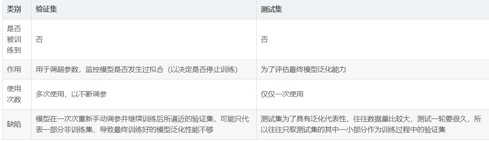
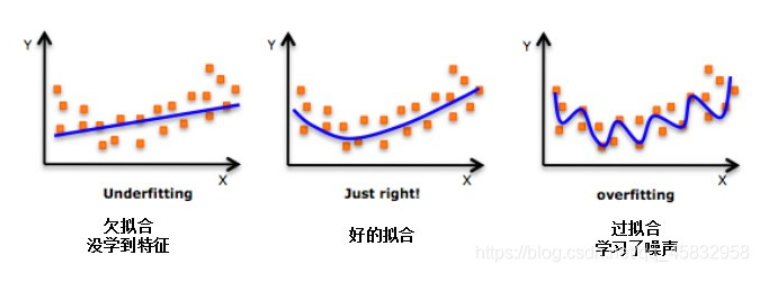
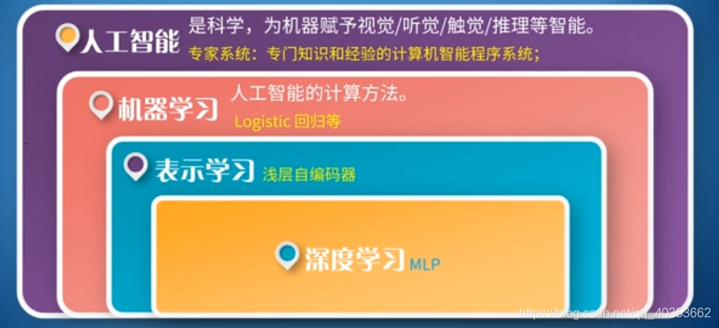
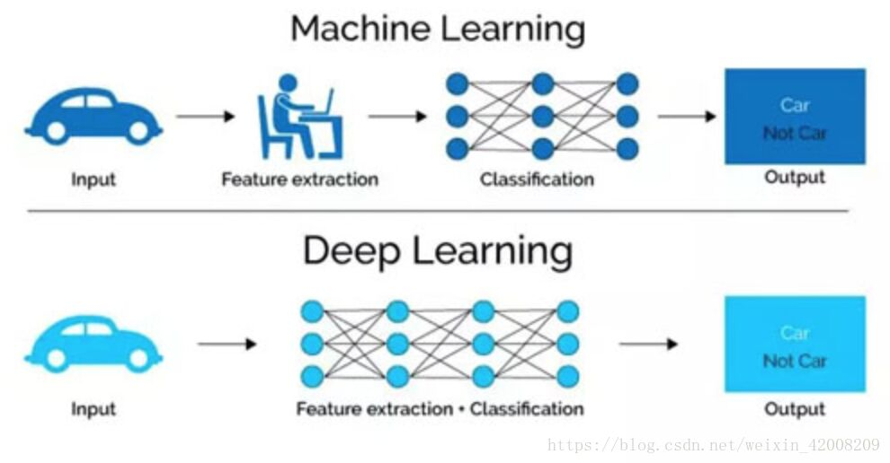
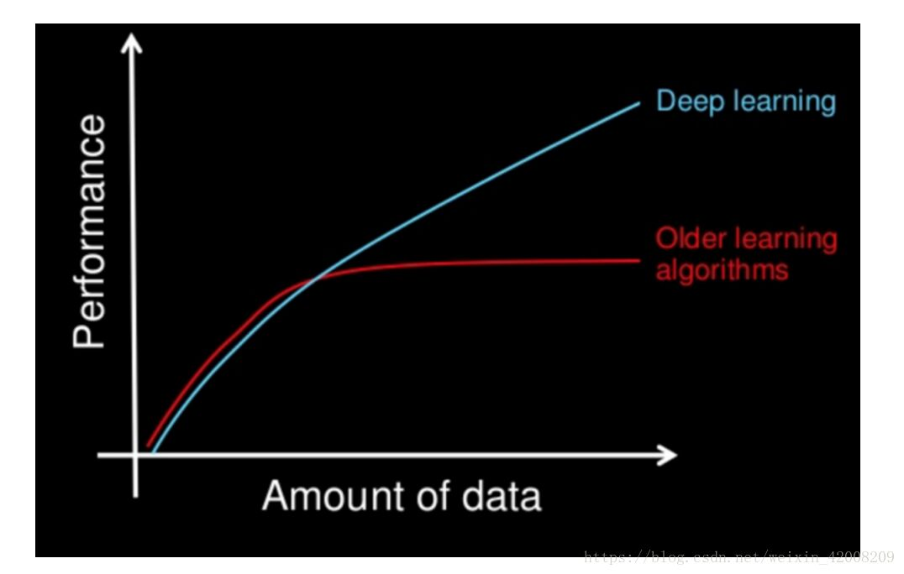
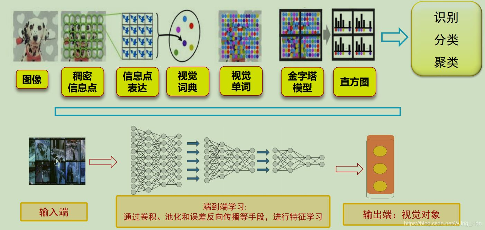
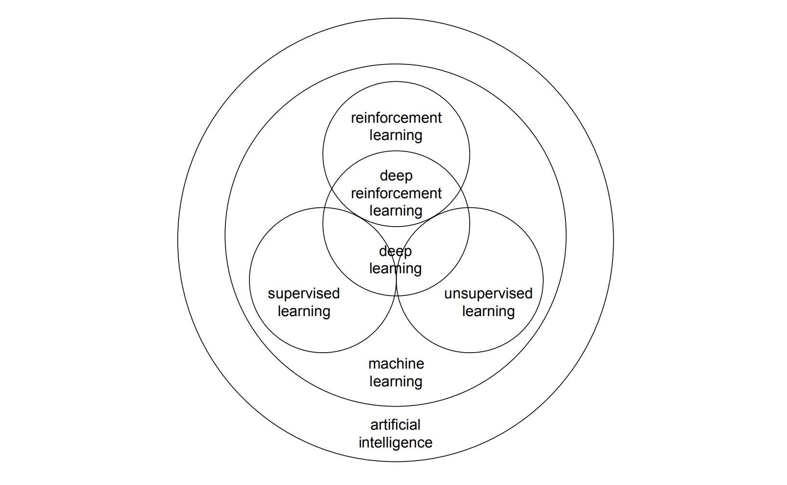

# **人工智能（Artificial Intelligence, AI）理论基础学习**

## 人工智能的三大学派
**（1）符号主义学派：基于数理逻辑，认为人类思维的过程可以用符号操作来描述，在给定由公理和规则组成的集合后，所有智能行为都能归结为对特定命题的判定问题。**
  * 精确逻辑：采用数理逻辑方法，对于命题可以用精确的规则进行划分。
    * 典型应用：专家系统，专家系统分为两个子系统：
      * 知识库：存储结构化信息。
      * 推理引擎：自动推理系统，用于评估知识库的当前状态，并应用相关规则进行逻辑推理，然后将新结论添加到知识库中。
      * 缺点：
        * 需要人为定义和补充规则，决定了专家系统的智能水平不会高于人类，无法解决复杂问题；
        * 基于逻辑推理，无法解决非逻辑性问题。
  * 模糊逻辑：元素可以属于多个不同的集合，元素和不同集合的关联性强弱由隶属度决定。
    * 模糊控制系统：
      * 模糊化：利用隶属函数完成输入变量的模糊化，得到模糊变量。
      * 模糊推理：通过规则器对输入进行推理，得到模糊控制变量。
      * 逆模糊：利用隶属函数去模糊化处理为精确的控制变量。
    * 一些定义：
      * 隶属度：用于表示不确定性的强弱，在概率随机性基础上加入了信息的意义和定性，是一种比随机性更加深刻的不确定性质。如35岁的人属于年轻人和中年人集合的隶属度可能为0.6和0.4。 
       
**（2）联结主义学派：基于神经网络，认为人类大脑的思维体系具有复杂的秉性结构，从神经元开始，进而研究神经网络模型和脑模型。**
  * 感知器（出现于20世纪60至70年代）：解决线性分类问题。
    * M-P模型（阈值加权和模型）：
      * 一个神经元接受的信号可以是起刺激作用的，也可以是起抑制作用的，其累积效果决定该神经元的状态，同时神经元的突触信号的输出是“全或无”，即仅当神经元接受的信号强度超过某个阈值时，才会由突触进行信号输出。
    * 学习算法：感知器学习算法。
      * 原理：输入连接的所有输出信号值和存储在处理单元局部内存中的参数值相互作用后得到求和累计值，输出通过激活函数进行处理。
      * 学习过程：**调整其中存储的参数值的过程。**
      * 分类：
        * 无监督学习：学习过程中，数据中输入样本的信息，但不知道输入和输出之间的关系，感知器通过学习抽取输入样本的特征或同级规律。如Hebb算法（赫布）。
        * 监督学习：学习过程中，数据是成对出现的，与输入对应的输出是已知的。通过逐步将集中的样本输入到网络中，根据输出结果和理想输出之间的差别来调整和学习感知器中存储的参数，从而使感知器的输出逐渐接近理想输出。如Delta法则（德尔塔，梯度下降）
    * 计算平台：晶体管。
    * 应用：几乎没有，因为需要收集大量的专门知识并定义庞杂的推理方案，成本高。
* 人工神经网络（Artificial Neural Network，即ANN ）（出现于20世纪80-90年代）：对生物神经网络的模仿，无法解决抑或问题。
    * 结构：
      * 输入层：接受来自网络外部的信号输入。
      * 隐藏层：对输入信号进行变换和学习，是人工神经网络强大学习和表达能力的来源。
      * 输出层：输出网络的计算结构。
    * 特点：
      * 信息是分布式存储和表示的。每个人工神经元中保存的参数值称为神经网络的长时记忆。**人工神经网络的学习过程，就是调整每个人工神经元保存的参数值的过程。**
      * 全局并行+局部操作。每个神经元的输入-输出映射具有局部性，全局并行使得可以高速并行地处理大量数据。
    * 学习算法：反向传播算法
      * 反向传播算法两个过程（反复执行这两个过程，直到一定的迭代次数或者损失函数不再下降为止）：
        * 前向传播：
          * 从输入层经隐藏层逐层处理后，传至输出层。
          * 通常网络输出与理想输出存在误差，用损失函数L（O,L）来计算实际输出和理想输出之间的误差，**网络的训练目标是最小化损失函数。**
        * 反向传播：
          * 利用损失函数计算输出层和理想输出之间的误差，并利用此误差计算输出层的直接前导层的误差，在用输出层前导层误差估计更前一层的误差。如此重复获得所有其他各层的误差估计。
          * 通过最小化每层的误差（梯度下降法）来修改每层的参数值，从而达到学习的目的。
    * 计算平台：图形处理器。
    * 应用：语音识别、图像识别、自动驾驶等。
* 深度学习（21世纪初-至今）：复杂函数
  * 特点：
    * 相比于传统人工神经网络最大的特点是网络成熟更多，利用了卷积神经网络和循环神经网络等更为复杂的结构，参数量成倍增长，使模型的表示和学习能力进一步提升。 
  * 学习算法：预训练+微调
    * 通过一个“预训练”的过程对神经网络进行逐层学习，在通过反向传播算法对整个网络进行“微调”。
  * 计算平台：分布图形处理器平台。
  * 应用：如图像、语音、自然语言处理等几乎所有人工智能领域。 
 
 **(3)行为主义学派：基于进化论，认为必须赋予机器自主感知和行动的能力，将重点放在语言、行为等外部信号的建模上。**
 * 进化计算算法：模拟生物种群在进化过程中的自然选择和自然遗传机制。
   * 遗传算法：模拟生物在自然环境中遗传和进化而形成的一种自适应全局优化概率搜索算法，按照与个体适应度成正比的概率决定当前群体中每个个体遗传到下一群体中的机会。
     * 三种遗传算法：
       * 选择算子：根据各个个体的适应度，按照一定的概率规则，从当前群体中选择出一些优良的个体遗传到下一代群体中。
       * 交叉算子：将群体内的各个个体随机搭配成对，对每一个个体，根据交叉概率交换它们之间的部分染色体。
       * 变异算子：对群体中的各个个体，以变异概率改变染色体上的基因值为其他的等位基因。
     * 遗传算法对群体反复执行选择、交叉、变异步骤，直到搜索群体找到目标函数的最优值或者满足收敛条件。
     * 特点：
       * 自适应概率搜索技术，增加搜索过程的随机性和灵活性。
       * 解空间的多点搜索，可并行处理，提高性能。
       * 以目标函数值作为搜索信息，不需要目标函数的导数等其他信息。
     * 一些定义：
       * 适应度函数：对问题中每个个体都能进行度量的函数。
       * 染色体：遗传算法使用固定长度的二进制符号串来表示群体中的个体。
 * 群体智能算法：对生物群体在协作和交互过程中涌现出的复杂行为进行建模。
   * 定义：指一群功能简单、具有信息处理能力、自组织能力的个体通过通信、交互、协作等手段所涌现出简单个体所不具备的复杂问题求解能力。
   * 特征：
     * 个体同质，没有中心控制节点，适用于并行计算模型；
     * 种群具有可扩展性，种群内个体数目可变；
     * 种群内部具有协作性，个体之间存在相互协作机制；
     * 种群具有临近性，个体之间交互机制的作用范围有限；
     * 种群具有自适应性，能顾根据环境变化自动调整；
     * 种群具有稳定性，某些个体故障不会影响到系统的正常工作。
   * 常见算法：
     * 蚁群算法：基于蚁群觅食行为的建模。
       * 特点:
          * 种群多样性：以随机概率选择路径。
          * 信息素更新的正反馈机制：某条路径更短，则往返时间越短，路径上信息素被更新的频率更高，路径上的信息素浓度更高。
       * 应用场景：组合优化问题，如任务调度问题、图着色问题、旅行商问题。
     * 粒子群算法：基于鸟群觅食行为的建模。
       * 可行解（鸟类）朝全局最优解（食物）移动和收敛的过程。
       * 一些定义：
          * 个体学习能力：个体记忆自身历史信息的能力。
          * 社会认知能力：感知临近个体飞行状态的能力。
       * 应用场景：对连续空间的优化求解问题。
       
  ## 机器学习
 * 学习就是系统在不断重复的工作中对本身能力的增强或者改进，使得系统在下一次执行同样任务或类似任务时，会比现在做的更好或效率更高。 
 * 机器学习是近20多年兴起的一门**多领域交叉学科，涉及概率论、统计学、逼近论、凸分析、算法复杂度理论等**多门学科。机器学习理论主要是涉及和分析一些让计算机可以**自动学习**的算法。 
 * 机器学习算法是一类从数据中自动分析获得规律，并利用规律对未知数据进行预测的算法。 
 
 
 
 ### 机器学习的定义
  * 系统通过获取经验替身自身性能的过程。即系统自我改进过程。机器学习是人工智能的核心研究领域之一。
  * 机器学习研究的是如何使计算机能够模拟或实现人类的学习功能，从大量数据中发现规律、提取知识，并在实践中不断完善和增强自我。
  * 机器学习的过程就是一个对包含可能假设的空间进行搜索的过程，使得到的假设在满足先验知识和其他约束的前提下，与给定训练样本是最吻合的。
  * 机器学习就是一类能够让计算机从大量已知的以特征向量表示的训练样本中，学习到一个泛华能力强的分类器的方法。
     * 分类器好坏的衡量标准：损失函数
       * 分类问题中，损失函数定义为机器学习得到的分类器对样本的分类结果和样本真实类别的差异。
       * 回归问题中，损失函数定义为学习得到的分布与样本的真实分布之间的差别。
    * 目标：最小化损失函数。
      * 优化方法：
        * 启发式的方法：
          * 遗传算法
          * 粒子群算法
        * 基于梯度方向的算法：
          * 批量梯度下降法
          * 随机梯度下降法
          * 小批量梯度下降法
    * 一些定义：
      * 梯度：是一个向量（矢量），表示某一函数在该点处的方向导数沿着该方向取得最大值，即函数在该点处沿着该方向（此梯度的方向）变化最快，变化率最大（为该梯度的模）。
      * 过拟合问题：简单的最小化损失函数在训练样本上的值，容易造成分类器对没有见过的样本的分类正确率降低，即分类器的泛华能力不够。
      * 惩罚项：在损失函数里添加的一个衡量分类器复杂度的标准。
        * 惩罚项通常由分类器参数的各种形式表征，当分类器形式太复杂时，使得损失函数的值也会比较大。
        * 作用：使得降低分类器错误率的同时，也能将分类器的形式限制得比较简单，保证它的泛华能力。 
         
 ### 机器学习的基本术语
* 我们看到一些关于橘子和橙子的数据集合，这些记录的集合称为**数据集**。 
* 每条记录是关于一个橘子或橙子的描述称为**示例或样本**。 
* 记录中的形状、剥皮、味道称为**属性或特性**。 
* 圆形、难、甜为各自属性或特征的**属性值**。 
* 如果把形状、味道、剥皮设为三个坐标轴，那么它们长成一个描述橘子或橙子的**属性空间或样本空间**，每个橘子或橙子都可以在属性空间中找到自己的坐标位置，我们把每个示例也称为**特征向量**。 
* D{x1,x2,...xm}是m个示例的数据集，xi={xi1,xi2,...xid}是d维样本空间X的一个特征向量，d为样本空间的维数。 
* 从数据中学得模型的数据称为**学习或训练**；这个过程通过某个学习算法来实现，训练过程中使用的数据称为**训练数据**，其中每个样本称为一个**训练样本**。训练样本组成的集合称为**训练集**。例如，橘子或橙子称为标记，拥有了标记的信息的实例称为**样例**。 
* 机器学习的任务一般有以下几类：
  * 当预测或输出的是**离散值**，此类学习任务称为**分类问题**。比如人脸识别、动作识别都是此类任务。
  * 当预测或输出的是**连续值**，此类学习任务称为**回归问题**。比如房价预测、股票价格预测等。
  * 对只涉及两个类别的分类问题称为**二分类任务**，常见于是否问题。比如划分是否为动物，肿瘤为良性或恶性，股票是涨还是跌等，我们经常说的正例、负例也是针对二分类问题。
  * 设计多个分类为**多分类任务**，二分类和多分类都是属于分类问题，由于二分类问题清醒简单而又广泛，所以单独列出为一类问题。
  * **聚类任务**是将相似的事物归类为一组，例如对文本数据集自动进行分组。
  * **多标签标注问题**是对一个变量序列的输入，获得一个变量序列的输出。多标签问题可以看做是分类任务的一种扩展，例如图像识别，在分类任务上会给出单个标签，如猫、狗、天空、森林等。而**多标签**是给一张图像多个类别，比如实际图像可能既有天空、大海、又有行人、房屋等。分类问题一般用于内容单一的图像，多标签则用于处理复杂场景的图像，也可用于图像检索的任务。  
### 监督学习、无监督学习、半监督学习、强化学习
 * **监督学习** 通过已有的训练样本去训练得到一个最优模型，再利用这个模型将所有的输入映射为相应的输出，对输出进行简单的判断从而实现预测和分类的目的，也就具有了对未知数据进行预测和分类的能力。简单来说，就像有标准答案的练习题，然后再去考试，相比没有答案的练习题然后去考试准确率更高。监督学习中的数据中是提前做好了分类信息的， 它的训练样本中是同时包含有特征和标签信息的，因此根据这些来得到相应的输出。**是从标签化训练数据集中推断出模型的机器学习任务**
* **无监督学习** 训练样本的标记信息未知，即**在算法构建的过程中不考虑Y的值，只通过特征信息去归纳出一些新的规律出来**，目标是通过对无标记训练样本的学习来揭示数据的内在性质及规律，为进一步的数据分析提供基础，此类学习任务中研究最多、应用最广的是"聚类" (clustering)，聚类目的在于把相似的东西聚在一起，主要通过计算样本间和群体间距离得到。
* **半无监督学习** 用少量的有标注的样本和大量未标注的样本进行训练和分类。
* **强化学习** 先行动起来，如果方向正确那么就继续前行，如果错了，子曰：过则勿惮改。吸取经验，好好改正，失败乃成功之母，从头再来就是。总之要行动，胡适先生说：怕什么真理无穷，进一寸有一寸的欢喜。
即想要理解信息，获得输入到输出的映射，就需要从自身的以往经验中去不断学习来获取知识，从而不需要大量已标记的确定标签，只需要一个评价行为好坏的奖惩机制进行反馈，强化学习通过这样的反馈自己进行“学习”。（当前行为“好”以后就多往这个方向发展，如果“坏”就尽量避免这样的行为，即不是直接得到了标签，而是自己在实际中总结得到的）
### 训练集、验证集、测试集、交叉验证
* 训练集（train set） —— **参与训练**，模型从训练集中学习经验，从而不断减小训练误差。这个最容易理解，一般没什么疑惑。
* 验证集（validation set）—— **不参与训练**，用于在训练过程中检验模型的状态，收敛情况。验证集通常用于调整超参数，根据几组模型验证集上的表现决定哪组超参数拥有最好的性能。同时验证集在训练过程中还可以用来监控模型是否发生过拟合，一般来说验证集表现稳定后，若继续训练，训练集表现还会继续上升，但是验证集会出现不升反降的情况，这样一般就发生了过拟合。所以验证集也用来判断何时停止训练。
    * 在神经网络中， 我们用验证数据集去寻找最优的网络深度（number of hidden layers)，或者决定反向传播算法的停止点或者在神经网络中选择隐藏层神经元的数量；
    * 在普通的机器学习中常用的交叉验证（Cross Validation) 就是把训练数据集本身再细分成不同的验证数据集去训练模型。
* 测试集（test set） —— **不参与训练**，用于在训练结束后对模型进行测试，评估其泛化能力。在之前模型使用【验证集】确定了【超参数】，使用【训练集】调整了【可训练参数】，最后使用一个从没有见过的数据集来判断这个模型的好坏。 

一个形象的比喻：

    训练集-----------学生的课本；学生 根据课本里的内容来掌握知识。

    验证集------------作业，通过作业可以知道 不同学生学习情况、进步的速度快慢。
    
    测试集-----------考试，考的题是平常都没有见过，考察学生举一反三的能力。 

**传统上，一般三者切分的比例是：6：2：2，验证集并不是必须的。**

**为什么要测试集?** 

* a)训练集直接参与了模型调参的过程，显然不能用来反映模型真实的能力（防止课本死记硬背的学生拥有最好的成绩，即防止过拟合)。 

* b)验证集参与了人工调参(超参数)的过程，也不能用来最终评判一个模型（刷题库的学生不能算是学习好的学生）。 

* c) 所以要通过最终的考试(测试集)来考察一个学(模)生(型)真正的能力（期末考试）。 

但是仅凭一次考试就对模型的好坏进行评判显然是不合理的，所以接下来就要介绍**交叉验证法** 

交叉验证法的作用就是尝试利用不同的训练集/验证集划分来对模型做多组不同的训练/验证，来应对单独测试结果过于片面以及训练数据不足的问题。（就像通过多次考试，才通知哪些学生是比较比较牛B的）。 

交叉验证的做法就是将数据集粗略地分为比较均等不相交的k份，
然后取其中的一份进行测试，另外的k-1份进行训练，然后求得error的平均值作为最终的评价。
### 泛华能力、误差、欠拟合与过拟合
* **泛化能力**：机器学习的目标是使学得的模型能够很好的适用于新的样本，而不是仅仅在训练样本上工作的很好。学得的模型对新样本（即新鲜数据）的适应能力称为泛化能力。
* **误差**：学习到的模型在样本上的预测结果与样本的真实结果之间的差 。
    * **训练误差**：模型在训练集上的误差。
    * **泛化误差（测试误差）**：在新样本上的误差。
* **欠拟合与过拟合**
    * 欠拟合：是指模型不能很好的捕获到数据特征，不能很好的拟合数据，学习能力底下,学得的模型训练误差很大。
      * 解决方法：增加模型的复杂度
    * 过拟合：是指模型不仅仅学习了数据集中的有效信息，也学习到了其中的噪音数据，使得模型在训练集上的表现非常好，但是对于测试集的预测效果很差,即泛化误差大（泛化能力较弱）。
      * 解决方案：
          * a.导致过拟合的一个原因可能是由于数据不纯、包含大量的噪声数据，这时候我们需要**重新清洗数据**。
          * b.**增加训练数据的样本量。**
          * c.采用**正则化方法**，降低模型参数复杂度（参数大小和参数量），从而降低模型复杂度
          * d.神经网络中常采用**dropout**方法：在训练的时候让神经元以一定的概率不工作。 
          
 
* **误差（训练误差、测试误差）和模型复杂度的关系** 
给定训练数据集，如果模型的复杂度过低，很容易出现欠拟合；如果模型复杂度过高，很容易出现过拟合 
 
 
### 编码器和解码器
* 编码器-解码器的结构在我们的日常生活中并不陌生。电话就是最典型的例子，它将声音信号编制成电信号，经过传输之后，在另外一端再将电信号恢复成声音信号。这样，对方就能在千里之外听到你的声音。在这里，电信号是声音信号的另外一种表示，这是物理上的变换，解码和编码通过硬件实现。
* 在机器学习中，很多问题可以抽象出类似的模型：
'''
机器翻译：将一种语言的句子转化成另外一种语言的句子。
自动摘要：为一段文字提取出摘要。
为图像生成文字解说：将图像数据转化成文字数据。
根据一段文字描述生成图像：这是上面问题的反过程，将文字转化成图像。

'''
* 在这些问题中，我们需要将输入数据转化成另外一种输出数据，二者之间有概率关系。例如，对于机器翻译来说，二者有相同的语义。
* 直接用一个函数完成这个转化 [公式] 可能会存在困难。例如对机器翻译来说输入和输出的长度是不固定的，二者还可能不相等。因此我们需要曲线救国，先将输入数据 [公式] 转化成一种中间数据 [公式] ，再从z映射出 [公式] 。这就是编码器、解码器结构。就像我们无法将声音直接传送到很远的地方去一样，借助于电信号这样的中间表示，我们可以更好的完成任务。
   
 ## 机器学习的分类
 * 按照训练样本的具体情况分类
   * 监督学习：用来训练分类器的训练样本由样本的特征向量和类别标号构成。
     * 常见监督学习算法：
       * 回归分析和统计分类
         * 线性回归
         * 决策树
         * 神经网络
   * 无监督学习：训练样本只有特征向量，而不包括每个向量对应的类别。
     * 常见的无监督学习算法：
       * 聚类分析
         * k-均值聚类
         * 模糊k-均值聚类
   * 半监督学习：介于监督学习和无监督学习之间，指在大量无类别标签的样本的帮助下，训练少量已有类别标签的样本，获得比仅仅利用这些很少的标注样本训练得到的分类器的分类能力更强的分类器，以弥补有类别标签的样本不足的缺点。 
   * 强化学习：在某个环境中，存在各种不同的状态，机器可以采取几种不同的动作使得自己在几种不同状态之间以一定的概率切换，不同的状态对应不同的结果，这个结果用汇报来衡量，通过强化学习找到策略，使得机器在面对不同的状态时采取合适的动作，使得获得的汇报最大。
* 按照算法的功能分类
  * 回归算法（预测连续目标变量）：通过最小化预测值与真实值之间差距，而拟合出输入特征之间的最佳组合的一类算法（用一条线来拟合一些离散的点）
    * 线性回归：利用最小二乘法建模因变量和一个或多个解释变量（或称为独立变量）之间对应关系的一种回归分析。
        * 学习方法：最小化基于预测值与真实值的均方误差所构成的损失函数
        * 最小二乘法（又称最小平方法）：是一种数学优化技术。它通过最小化误差的平方和寻找数据的最佳函数匹配。利用最小二乘法可以简便地求得未知的数据，并使得这些求得的数据与实际数据之间误差的平方和为最小。最小二乘法还可用于曲线拟合。其他一些优化问题也可通过最小化能量或最大化熵用最小二乘法来表达。
        * 应用场景：
           * 通过拟合函数根据自变量预测出一个因变量值
           * 用来量化因变量与自变量之间相关性的强弱，评估出某些与自变量不相关的因变量
    * 非线性回归：
       * 学习方法：最小化基于预测值与真实值的均方误差所构成的损失函数
       * 非线性的，模型可以是如对数、指数、高次方程等等
  * 分类算法（预测离散目标变量）：通过训练样本学习到每个类别的样本特征，利用这些特征构建分类线或分类面，将各种不同的样本分隔开，并且最小化错分样本数量的一类算法。
    * 贝叶斯分类算法(监督)：基于贝叶斯公式，逆概问题
       * 利用现有信息，计算出某些相关事件的先验概率，然后利用贝叶斯公式根据已知的经验计算得到需要的后验概率。
    * 决策树算法（监督）：某项活动开展与否，去决定于一系列前提条件，并且我们已经有了在这些条件下活动是否进行的训练数据，我们可以根据这些数据，按照是否满足某个特定的条件，逐步缩小活动是否开展所要考虑的条件范围，最终给出是否开展活动的确定性答案。
      * 决策树是一个预测模型，代表的是对象属性和对象值之间的一种映射关系
      * 每个结点表示某个对象，每个分叉路径代表某个可能的属性值，每个叶节点对应从根节点到该叶节点所经历的路径所表示的对象的值
      * 决策树构建过程是一个自顶向下的贪心递归过程
      * 缺陷：
        * 容易陷入过拟合，解决方法：预剪枝以及剪掉树中那些样本数非常少的结点，去除特例样本带来的冗余信息
    * 支持向量机（SVM,Support Vector Machine）（监督）：不仅考虑将训练样本正确区分开，而且考虑分类线（面）的位置，使得它能够将各类样本尽可能分隔得足够远
         * 可以解决线性不可分隔，通过核函数映射，使得在低维空间表示不可分的样本，通过投影到更高维的空间就可以变成线性可分的了。
         * 一些定义：
           * 核函数：核函数就是低维空间中的内积的某个函数，通过核函数可以计算出高维空间中两个数据点之间的距离和角度
    * 近邻算法（监督）：
       * K-近邻算法：基于实例的学习算法
          * 算法在对未知样本进行分类时，需要先计算它与所有一致类别标签的样本的欧式距离，然后找出与它距离最近的k个样本，这k个样本中哪个类别样本数最多，就将这个未知的样本分类为对应的类别
          * k通常取不能被类别整除的值
    * 聚类算法（无监督）：基于距离的聚类算法（迭代求解）
      * 预将数据分为k组，则随机选取K个对象作为初始的类别中心，然后计算每个对象与类别中心之间的距离，把每个对象分配给距离它最近的类别中心。类别中心以及分配给它们的对象就代表一个聚类。每分配一个样本，聚类的类别中心点会根据聚类中现有的对象被重新计算。这个过程将不断重读直到满足某个终止条件。终止条件可以是没有（或最小数目）对象被重新分配给不同的聚类，没有（或最小数目）聚类中心在发生变化，误差平方和局部最小。
   * 深度学习算法（深度神经网络）：相比于人工神经网络，其拓扑结构上节点层数比较多。
     * 定义：
       * 一种多层描述的表示学习，通过组合简单、非线性模块来实现，每个模块都会将最简单的描述（从原始输入开始）转变为较高层、较为抽象的描述。
       * 深度学习善于在高纬度的数据中摸索出错综复杂的结构。
     * 举例子：图像识别：
       * 第一特征层：机器学到的特征主要是图像中特定方位、位置边缘的信息
       * 第二特征层：机器通过发现特定边缘的组合来检测图案，此时机器并不考虑边缘位置的微小变化
       * 第三特征层：机器将局部图像与物体相应部位匹配
       * 后续层级：将局部组合起来从而识别出整个物体
       * 局部轮廓边缘组合形成基本图案，基本图案形成物体的局部，局部物体再组成物体。
     * 常用网络结构：
       * 卷积神经网络（Convolutional Neural Networks，CNN）(监督)： 
      
         * 一些定义：
             * 离线的卷积计算：由一个特征图执行的过滤操作
             * 通道：一个通道是对某个特征的检测，通道中某一处数值的强弱就是对当前特征强弱的反应
         * 卷积层：通道与通道之间进行交互，探测前一层中特征之间的局部连接，之后再下一层生成新的通道
             * 一个卷积层单元通过一组滤波器权值连接到前一层的特征图的局部数据块；接下来，得到的局部加权和会传递至一个非线性函数进行变换计算激励值
         * 池化层：对语义相似的特征进行合并
             * 一个池化层单元通常会计算一个或几个特征图中一个局部块的最大值，相邻的池化单元则会移动一列或一行从小块读取输入
         * 常见应用
             * 人脸识别
             * 语音识别
             * 文本识别
             * 生物信息分割
       
        * 循环神经网络（Recurrent Neural Network,RNN,也称递归神经网络)：通常用于需要序列连续输入的任务，如语音和语言 
           * 循环神经网络一次处理一个输入序列元素，同时维护的隐藏层单元中隐含着该序列过去所有元素的历史信息。
               * 编码器：一种在最后隐藏层将像素转换为活动向量的深度卷积网络
               * 解码器：一种类似机器翻译和神经网络语言模型的循环神经网络
           * 特殊隐藏层单元的长短期记忆网络：能够长期保存输入的信息
           * 一些定义：
               * 隐藏层：把输入数据的特征，抽象到另一个维度空间，来展现其更抽象化的特征，这些特征能更好的进行线性划分。
       * 对抗神经网络（Generative Adersarial Networks,GAN）:由判别模型和生成模型组成，可以利用对抗过程估计生成模型。 
            * 一个网络生成模拟数据，另一个网络判断生成的数据是真实的还是模拟的。生成模拟数据的网络要不断优化自己让判别的网络判断不出来，判别的网络也要不断优化自己让判断更加精确。两者的关系形成对抗，因此叫对抗神经网络。
        * 自编码机（Auto Encoder）(无监督）：基于多层神经元，主要用于数据的降维或者特征的抽取。
        * 玻尔兹曼机：受统计力学启发的多层学习机，它是一类典型的随机神经网络，属于反馈神经网络。
             * 离散Hopfield神经网络+模拟退火+隐单元=Boltzman机
    * 强化学习（Reinforcement Learning,RL，深度增强学习）：一种试错的学习方式，解决决策制定问题，学会根据自身所处环境自动做出相应决策
      * 定义：一个序列决策制定问题，它需要连续选择一些动作，从而使得机器在执行这些动作之后获得最大的收益、最好的结果。
      * 四个主要元素：
        * 环境状态集合S
        * 动作结合A
        * 状态之间的转换规则P
        * 特定动作导致的状态转移之后带来的回报R
      * 学习过程：
        * 探索：放弃一些已知的回报信息，而去尝试一些新的选择。
        * 利用：根据已知的信息使回报最大化，充分利用现有的对于环境的认识。
     * 演化学习：一个受益于自然演化的大型启发式随机优化算法
       * 演化算法在模拟自然演化的过程中主要考虑了两个关键因素：
         * 变分再生产：从当前的解集中通过某种方法产生新的解集。
         * 优选：不断的通过优胜劣汰的策略去剔除当前表现不达标的解集。
       * 常见演化算法：
         * 遗传算法（GA）
         * 遗传规划（GP）
         * 演化策略（ES）  
 ## 机器学习实际操作的7个步骤
 * 收集数据
 * 数据准备
 * 选择一个模型
 * 训练
 * 评估
 * 参数调整
 * 预测（开始使用）
 
 
  ## 机器学习与人工智能的区别
  * **人工智能**是最初始的理论体系，是一门科学。
  * **机器学习**是人工智能的计算方法，包含Logistic、SVM、决策树、贝叶斯方法等。
  * **表示学习**是机器学习中研究如何得到一个好的表示，从而使后续的模型学习更容易，**浅层自编码机**就是其中的一种方法。
  * **深度学习**目前我们进行大数据机器学习的主要方法，**多层感知机**就是深度学习的一种，还包括**卷积神经网络**，**深度循环网络**，**深度Q网络**等。 
  
 
  ## 机器学习和深度学习的区别
  
  * 深度学习是机器学习算法的子类，其特殊性是有更高的复杂度。因此，深度学习属于机器学习，但它们绝对不是相反的概念。而将浅层学习称为不是深层的那些机器学习技术。
  * 特征提取方面。
  ***深度学习的好处是用非监督式或半监督式的特征学习和分层特征提取高效算法来替代手工获取特征。***
      * 机器学习的特征工程步骤是要靠手动完成的，而且需要大量领域专业知识。
      * 深度学习通常由多个层组成，它们通常将更简单的模型组合在一起，将数据从一层发传递到另一层来构建更复杂的模型。通过训练大量数据自动得出模型，不需要人工特征提取环节。
   **深度学习算法试图从数据中学习高级功能，这是深度学习的一个非常独特的部分，因此，减少了为每个问题开发新特征提取器的任务。适用在提取特征的图像、语音、自然语言处理领域。**
 * 数据量和计算性能要求
     * 机器学习需要的执行时间远少于深度学习，深度学习参数往往很庞大，需要通过大量数据的多次优化来训练参数。
   
   * 深度学习需要大量的训练数据集
   * 训练深度神经网络需要大量的算力，可能要花费数天、甚至数周的时间，菜能使用数百万张图片的数据集训练出一个深度网络。所以深度学习通常
       * 需要强大的GPU服务器来进行计算
       * 全面管理的分布式训练与预测服务————比如谷歌 TensorFlow 云机器学习平台
* 算法代表
    * 机器学习
        * 朴素贝叶斯、决策树等
    * 深度学习
        * 神经网络
  ## 深度学习方法和其它人工智能方法的共性和差异
  **人工智能可以大致分为3种学习方法：**
  * 一种是**基于规则**的系统，另一种是**经典的机器学习方法或系统，**还有一种是**表示学习方法或系统**。
  * 基于规则的系统
     * 它没有可学习的模块，输入的数据通过手工设计的程序，直接获取特征然后输出。
  * 经典的机器学习方法或系统
     * 数据输入后通过手工设计获得特征，然后经过特征映射获得输出。
  * 表示学习方法或系统
     * 分为两类：**一类是非深度学习方法，一类是深度学习方法**。基于非深度学习方法是通过特征获得的，然后通过特征映射输出；而基于深度学习方法，首先学习得到简单的特征，然后通过附加的层去学习得到更多抽象的特征，最后通过特征映射输出结果。    
  ## 深度学习和浅层学习的区别
  **简单来说，浅层学习采取的是分段学习的手段，而深度学习采取的是端到端学习的手段**
  * 比如给出一幅图像，若是采用浅层学习，我们首先需要从图像中检测出其**关键的信息点**，然后对这些信息点进行表达，如著名的Sift算法，就形成了每个像素点128维的**向量**，我们可以对信息点的表达向量进行聚类，得到信息点所组成的**视觉词典**，在视觉词典的基础之上，我们用一个一个的视觉单词来表达整幅图像，由于图像具有空间近邻关系，因此，我们可以通过金字塔模型来捕获视觉单词之间所形成的**空间结构**，在金字塔模型的基础之上，可以形成图像的视觉直方图，图像从而表达成了视觉图像直方图的向量形式，居于此我们可以对图像进行聚类、分类。
  * 不同阶段（子任务）的分析手段我们可以加以改造，即在每一个阶段里我们可以用自己所定义的良好算法得到该阶段可以得到的更好的结果。
  * 深度学习采取的是端到端的学习方法，这里的端到端指的是**输入端到输出端**，从输入端输入经过卷积、池化、反向传播等操作后可得到原始数据的**特征表达**，基于此特征表达，我们能够对原始数据进行识别与分类，在这个过程里，我们没有将学习的任务分成一段一段不同的子任务加以分析与处理。
  * 也就是说，深度学习和浅层学习采取了完全不同的处理手段，它是从输入端输入数据，然后传到中间层，通过层层抽象的方法直接得到输入数据的特征表达，进而对这种特征表达进行分析与处理，它是一种端到端的学习方法。
  

  ## 深度学习和强化学习的区别
  * 深度学习的训练样本是有标签的，强化学习的训练是没有标签的，它是通过环境给出的奖惩来学习。
  * 深度学习的学习过程是静态的，强化学习的学习过程是动态的，这里静态与动态的区别在于是否与环境进行交互，深度学习是给什么样本就学什么，而强化学习是要和环境进行交互，在通过环境给出的奖惩来学习。
  * 深度学习解决的更多是感知问题，强化学习解决的主要是决策问题，有监督学习更像是“五官”，而强化学习更像是"大脑"。
  ## 强化学习和监督学习的区别
 * 强化学习 ：研究的是智能体agent与环境之间交互的任务，也就是让agent像人类一样通过试错，不断地学习在不同的环境下做出最优的动作，而不是有监督地直接告诉agent在什么环境下应该做出什么动作。在这里我们需要引入回报（reward）这个概念，回报是执行一个动作或一系列动作后得到的奖励，比如在游戏超级玛丽中，向上跳可以获得一个金币，也就是回报值为1，而不跳时回报就是0。回报又分为立即回报和长期回报，立即回报指的是执行当前动作后能立刻获得的奖励，但很多时候我们执行一个动作后并不能立即得到回报，而是在游戏结束时才能返回一个回报值，这就是长期回报。强化学习唯一的准则就是学习通过一序列的最优动作，获得最大的长期回报。比较有挑战性的是，任一状态下做出的动作不仅影响当前状态的立即回报，而且也会影响到下一个状态，因此也就会影响整个执行过程的回报。
 * 强化学习是一个连续决策的过程，传统的机器学习中的有监督学习是给定标签但有时候，并不知道标签是什么，即一开始不知道什么是“好”的结果，所以RL不是给定标签，而是给一个回报函数，这个回报函数决定当前状态得到什么样的结果（“好”还是“坏”），其数学实质是一个马尔可夫决策过程。最终的目的是决策过程中回报函数期望最优。
 * 这个过程有点像有监督学习，只是标签不是预先准备好的，而是通过一个过程来回的调整并给出标签，这个过程就是强化学习。
     *  强化学习是试错学习(Trail-and-error)，由于没有直接的指导信息，智能体要以不断与环境进行交互，通过试错的方式来获得最佳策略。
    * 延迟回报，强化学习的指导信息很少，而且往往是在事后（最后一个状态）才给出的，这就导致了一个问题，就是获得正回报或者负回报以后，如何将回报分配给前面的状态。
  
  ## 机器学习VS深度学习VS强化学习
  * 机器学习：一切通过优化方法挖掘数据中规律的学科，多用于数据挖掘、数据分析和预测等领域。
  * 深度学习：一切运用了神经网络作为参数结构进行优化的机器学习算法，广泛的应用于计算机视觉和自然语言处理领域。
  * 强化学习：不仅能利用现有数据，还可以通过对环境的探索获得新数据，并利用新数据循环往复地更新迭代现有模型的机器学习算法，学习是为了更好地对环境进行探索，而探索是为了获得数据进行更好的学习
  * 深度强化学习：一切运用了神经网络作为参数结构进行优化的强化学习算法。
 ## 机器学习VS深度学习VS迁移学习
 * **迁移学习**顾名思义就是把已学训练好的模型参数迁移到新的模型来帮助新模型训练。考虑到大部分数据或任务是存在相关性的，所以通过迁移学习我们可以将已经学到的模型参数（也可理解为模型学到的知识）通过某种方式来分享给新模型从而加快并优化模型的学习效率不用像大多数网络那样从零学习 (Starting From Scratch)。 
 ***迁移学习是机器学习技术的一种，其中在一个任务上训练的模型被重新利用在另一个相关的任务上。**
 * 迁移学习还与多任务学习和概念漂移等问题有关，它**并不完全是深度学习的一个研究领域**。尽管如此，由于训练深度学习模型需耗费巨大资源，包括大量的数据集，迁移学习便成了深度学习中一种很受欢迎的方法。但是，只有当从第一个任务中学到的模型特征是容易泛化的时候，迁移学习才能在深度学习中起到作用。“在迁移学习中，我们首先在基础数据集和任务上训练一个基础网络，然后将学习到的特征重新调整或者迁移到另一个目标网络上，用来训练目标任务的数据集。如果这些特征是容易泛化的，且同时适用于基本任务和目标任务，而不只是特定于基本任务，那迁移学习就能有效进行。”——深度神经网络中的特征如何迁移的？这种用于深度学习的迁移学习形式被称为**推导迁移** (Inductive Transfer)。就是通过使用合适但不完全相同的相关任务的模型，将模型的范围（模型偏差）以有利的方式缩小。 
 ***迁移学习使用方法**：我们可以在自己的预测模型问题上使用迁移学习，通常有两种方法：**开发模型方法**和**预训练模型方法***。 
   * 对于**开发模型方法**，分为四步：
 
        * 选择源任务:必须选择一个与大量数据相关的预测模型问题，这个大量的数据需要与输入数据，输出数据和/或从输入到输出数据映射过程中学习的概念之间存在某种关系。

        * 开发源模型:接下来，必须为这个第一项任务开发一个熟练的模型；该模型必须比原始模型更好，以确保一些特征学习已经发挥了其作用。

        * 重用模型:然后可以将适合源任务的模型用作感兴趣的另一个任务模型的起点；这取决于所使用的建模技术，可能涉及到了全部或部分模型。

        * 调整模型:可选项，对感兴趣任务的调整输入—输出配对数据或改进模型。

  * 对于**预训练模型方法**，分为三步：

    * 选择源任务:从可用的模型中选择预训练的源模型，许多研究机构会发布已经在大量的且具有挑战性的数据集上训练好的模型，在可用模型的模型池里面也能找到这些模型。

    * 重用模型:然后可以将预训练的模型用作感兴趣的另一个任务模型的起点，这取决于所使用的建模技术，可能涉及使用全部或部分模型。 
    
    * 调整模型:可选项，对感兴趣任务的调整输入—输出配对数据或改进模型。 
 **其中，第二类迁移学习方法在深度学习领域是很常见的。**
 
 * 当前的机器学习、深度学习存在一些局限性，我们采用迁移学习的方法可以解决这些痛点。
     * 我们可以在这个数据集上训练一个模型A，并期望它在同一个任务和域A中的未知数据上表现良好；但是，当我们没有足够的来自于我们关心的任务或域的标签数据时（新的标签数据很难获取、昂贵），传统的监督学习方法会失灵————它往往无法得到一个可靠的模型。
     * 表达能力的限制：因为一个模型毕竟是一种现实的反应，等于是现实的镜像，它能够描述现实的能力越强就越准确，而机器学习和深度学习都是用变量来描述世界的，它们的变量数是有限的。
     * 模型复杂度高：随着模型复杂度的提高，其参数个数和所需的数据量也是惊人的。 
     
**以上讨论的算法和人工智能的关系如上图所示，可以看出，提及的算法都是属于人工智能的范畴，它们相互交叉却不完全重合：机器学习是人工智能的算法基石，而其他算法都是机器学习的一个分支。**